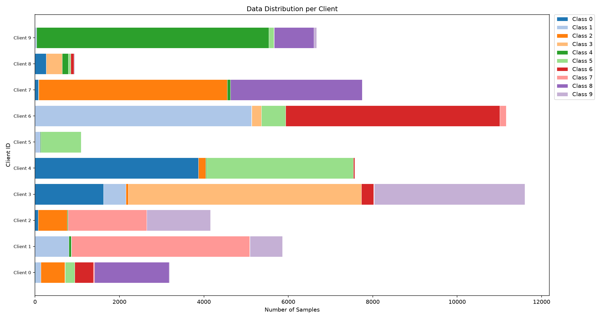
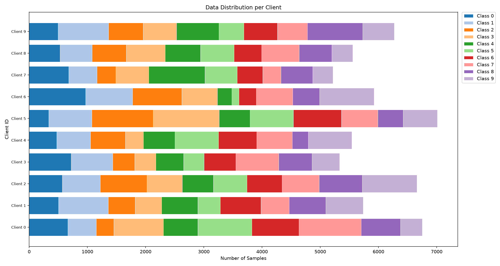
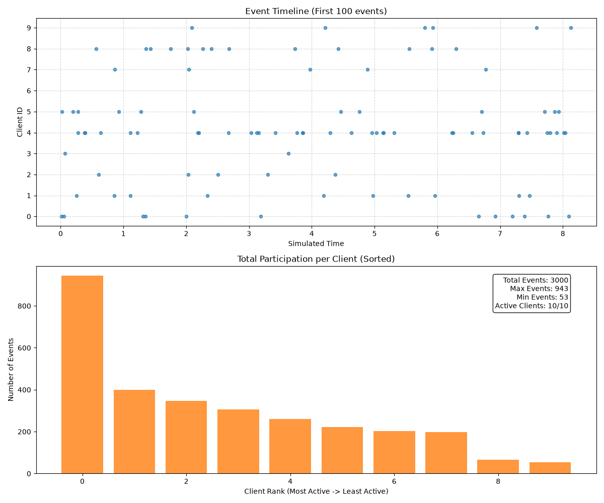
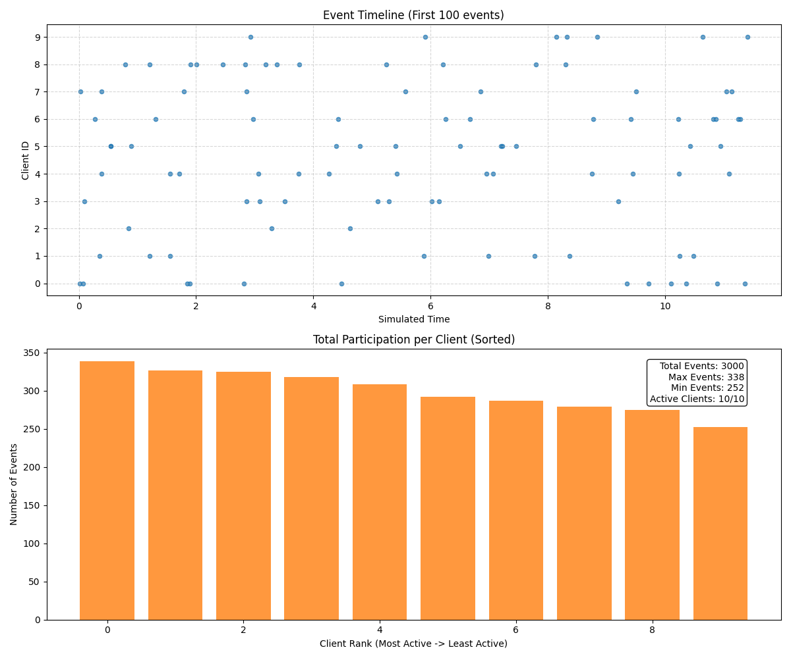
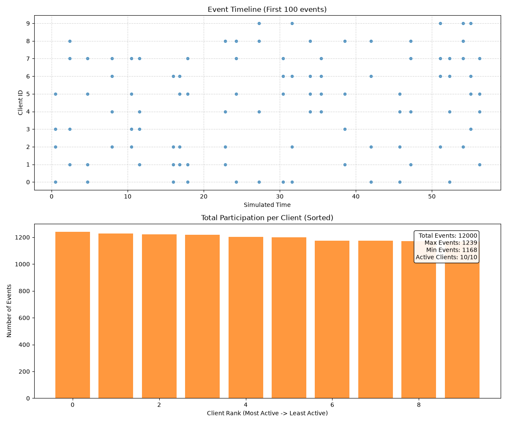

# Modeling System Heterogeneity

To evaluate Federated Learning performance under diverse and realistic conditions, AFL-Sim permits users to customize the following client-side characteristics:

- The local data distribution at each client.
- The latency (response time) distribution for each client.

Using the values of user-specified configuration parameters, AFL-Sim synthesizes realistic data splits and sequences of client arrivals before the simulation begins to execute. Both data splits and client arrivals can be exactly reproduced based on their respective user-provided random seeds.

!!! tip
    Check the [Dataset](../user_guide/configuration.md#dataset) and [Simulation Parameters](../user_guide/configuration.md#simulation-parameters) sections in [Setting Up a YAML Configuration](../user_guide/configuration.md) for guidance on tuning the dataset and latency configuration parameters, respectively.

## Dataset Splits

AFL-Sim generates data splits by sampling a [Dirichlet distribution](https://en.wikipedia.org/wiki/Dirichlet_distribution) $Dir(\alpha)$, where $\alpha$ is a positive parameter controlling the homogeneity of the resulting split. Smaller values of $\alpha$ yield more heterogeneous local datasets, while higher values approach the independent and identically distributed (IID) case.

The following information must be specified by the user:

* The dataset name (`dataset`).
* The value of the Dirichlet parameter $\alpha$ (`dirichlet_alpha`).
* The random seed on which the split will be conditioned (`split_seed`).
* The total number of participating clients (`num_clients`).
* The training batch size (`batch_size`).

The procedure AFL-Sim follows to synthesize a dataset split is summarized in the diagram below:

1. For every label in the dataset, draw a sample from $Dir(\alpha)$ with size equal to `num_clients`. This will return a vector with each client's proportion of the training samples with that label.
2. Divide the training samples with that label to clients as indicated by the sample drawn.
3. Once all labels have been processed, check if each local dataset contains at least `batch_size` samples. If it does, the split has been successfully generated.
4. If one or more clients have been assigned less than `batch_size` samples, check how many attempts have been made to generate the split. If the maximum allowable attempts (hardcoded to `5,000`) have been exceeded, **the simulation is aborted** and the user is prompted to increase $\alpha$.
5. If the maximum number of attempts has not been exceeded, return to Step 1.

``` mermaid
---
title: Data Split Generation
---
stateDiagram-v2
    direction TB
    state if_retries <<choice>>
    state if_size <<choice>>

    [*] --> InitLabel
    InitLabel: Initialize Label ID = 0

    InitLabel --> ProcessLabel

    ProcessLabel: 1. Sample Dirichlet<br/>2. Split Samples<br/>3. Label ID += 1

    ProcessLabel --> ProcessLabel: Label ID < Num Labels
    ProcessLabel --> CountBins: Label ID == Num Labels

    CountBins: Count Local<br/>Samples
    CountBins --> if_size: Samples < Batch Size?

    if_size --> Success: No
    Success: Success<br/>(Batch Size Met)
    Success --> [*]

    if_size --> Retries: Yes
    Retries: Increment & Check<br/>Attempts

    Retries --> if_retries: Attempts Exceeded?

    if_retries --> Aborted: Yes
    Aborted: Aborted<br/>(Max Attempts)
    Aborted --> [*]

    if_retries --> InitLabel: No
```

!!! warning
    Due to datasets containing a finite number of training samples, synthesizing a valid data split becomes exceedingly harder as `num_clients` grows, the `batch_size` increases, and $\alpha$ decreases.

Two examples of MNIST dataset splits generated by AFL-Sim are depicted below: a heterogeneous split ($\alpha=0.1$, top) and a homogeneous split ($\alpha=10.0$, bottom). The images were automatically generated by setting AFL-Sim's configuration parameter `visualize_data_split` to `True`.

<figure markdown="span">

{ width="600" }

<figcaption>MNIST split across $10$ clients with $\alpha=0.1$.</figcaption>

</figure>

<figure markdown="span">

{ width="600" }

<figcaption>MNIST split across $10$ clients with $\alpha=10.0$.</figcaption>

</figure>

## Client Latency Distributions

To simulate variations in client response latency, AFL-Sim can generate client delays/arrivals at the server with varying statistics. These delays encompass the client's training time, communication overhead, and all additional delays (e.g., loading data from disk) incurred between consecutive communications with the server.

AFL-Sim generates client arrivals based on the following parameters:

* A mean value $\mu$ hardcoded to $0$.
* A user-specified standard deviation $\sigma$ (`client_rate_std`).
* The random seed on which the arrivals will be conditioned (`rate_seed`).
* The total number of participating clients (`num_clients`).
* If the communication strategy is synchronous (`sync`), the number of clients sampled by the server at each Federated Learning round (`sample_size`).

The first step in simulating client arrivals is to generate each client's arrival rate by sampling a [log-normal distribution](https://en.wikipedia.org/wiki/Log-normal_distribution) $Lognormal(\mu, \sigma^2)$. The smaller the value of $\sigma$, the more homogeneous the resulting arrival rates and the less noticeable the straggler effect. Note that the mean arrival rate will be approximately $\exp(\sigma^2/2)$ arrivals per simulation time unit[^1].

AFL-Sim then proceeds to generate a fixed number of simulation events (hardcoded to `3,000`) called a "clock chunk". One event in a clock chunk corresponds to a single client arrival in asynchronous mode, or to the arrival of all sampled clients in a single Federated Learning round in synchronous mode. As a result, clock chunk generation differs across the two modes.

=== "Asynchronous Mode"

    In asynchronous mode, clock chunks are generated using [Poisson Thinning](https://stats.libretexts.org/Bookshelves/Probability_Theory/Probability_Mathematical_Statistics_and_Stochastic_Processes_(Siegrist)/14%3A_The_Poisson_Process/14.05%3A_Thinning_and_Superpositon):

    * All the events in the clock chunk are generated by accumulating samples of an exponential distribution with parameter equal to the sum of the individual client rates (aggregate rate).
    * Each event in the chunk is assigned to a client with probability equal to the client's rate over the aggregate rate.

=== "Synchronous Mode"

    AFL-Sim executes the following steps to generate clock chunks in synchronous mode:

    * For each event in the clock chunk, AFL-Sim determines which clients are sampled by the server by **uniformly** sampling `sample_size` clients.
    * For each event/client sample, a response delay is generated for all clients in the sample by sampling an exponential distribution with parameter equal to the client's arrival rate.
    * The maximum client delay for each sample is selected to be the corresponding Federated Learning round's length.
    * The individual round lengths are accumulated to generate the progression of simulated time.

!!! info
    When resuming a simulation, if more than half of the current clock chunk has been exhausted, AFL-Sim will automatically generate a new chunk and append it to the current one. Mathematical continuity between chunks is guaranteed.

Three examples of client arrivals generated by AFL-Sim for $10$ clients are shown below: heterogeneous asynchronous arrivals ($\sigma=1.0$, top), homogeneous asynchronous arrivals ($\sigma=0.01$, middle) and synchronous arrivals with $4$ clients sampled at each round ($\sigma=0.01$, bottom).

!!! note
    In synchronous mode, client participation will always be close to equal regardless of the value of $\sigma$ due to AFL-Sim's hardcoded uniform client sampling. However, as $\sigma$ increases so will the range of the simulated time axis, as the maximum client delay increases with $\sigma$.

The images below were automatically generated by setting AFL-Sim's configuration parameter `visualize_client_arrivals` to `True`.

<figure markdown="span">

{ width="600" }

<figcaption>Asynchronous arrivals from $10$ clients with $\sigma=1.0$.</figcaption>

</figure>

<figure markdown="span">

{ width="600" }

<figcaption>Asynchronous arrivals from $10$ clients with $\sigma=0.01$.</figcaption>

</figure>

<figure markdown="span">

{ width="600" }

<figcaption>Synchronous arrivals from $10$ clients with sample size $4$.</figcaption>

</figure>

[^1]: A simulation time unit is an artificial quantity distinct from wall-clock time, and can be converted to any desired time unit, e.g., seconds, hours, etc.
